**Цель работы:** вычислить свёртку 2D биполярных изображений «О» и «П» при величине сдвига по оси y = 0, ∆, 2∆, 3∆, 4∆:

Рис. 1. Двумерные биполярные изображения «O» и «П»

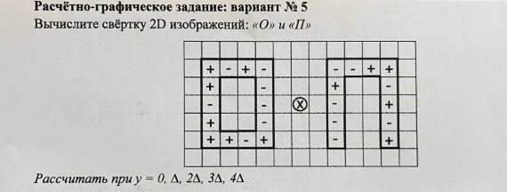

**II. Расчёт.** 

1) Отображение «П» по горизонтали:

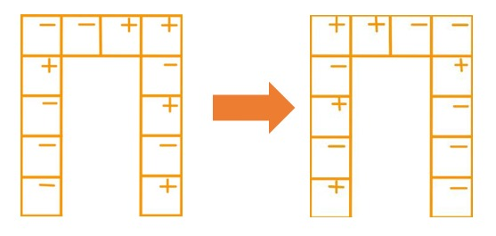

2) Отображение горизонтального «П» по вертикали:

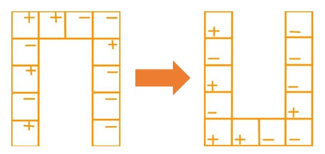

Таким образом, получаем следующую свертку:

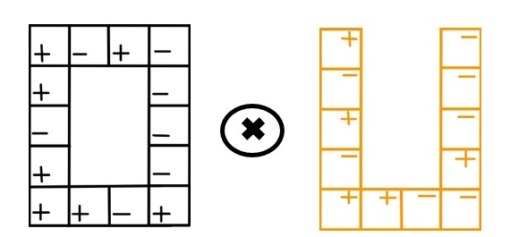

1) Сечение 1 при у = 0:

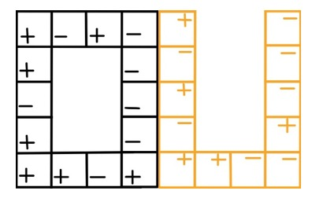

g = (x2 = 4∆; y2 = 0) = 0

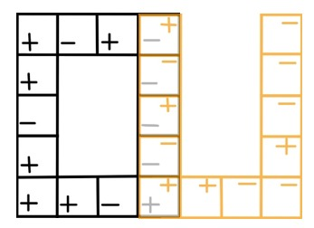

g = (x2 = 3∆; y2 = 0)= -∆2 + ∆2 - ∆2 + ∆2 + ∆2 = ∆2

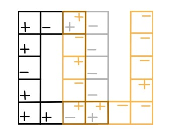

g = (x2 = 2∆; y2 = 0) = ∆2 - ∆2 + ∆2 = ∆2

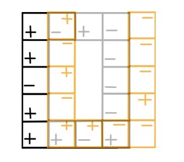

g = (x2 = ∆; y2 = 0) = -∆2 + ∆2 - ∆2 - ∆2 = -2∆2

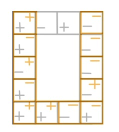

g = (x2 = 0; y2 = 0) = +∆2 - ∆2 - ∆2 - ∆2 + ∆2 + ∆2 + ∆2 - ∆2 - ∆2 + ∆2 + ∆2 + ∆2 = 2∆2

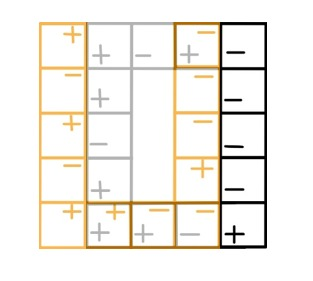

g = (x2 = -∆; y2 = 0) = -∆2 + ∆2 - ∆2 + ∆2 = 0

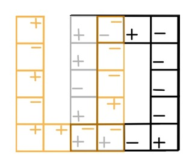

g = (x2 = -2∆; y2 = 0) = +∆2 - ∆2 - ∆2 = -∆2

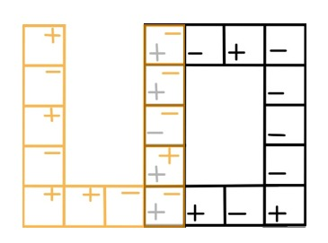

g = (x2 = -3∆; y2 = 0) = -∆2 - ∆2 + ∆2 + ∆2 - ∆2 = -∆2

g = (x2 = -4∆; y2 = 0) = 0

Рис. 2. График интенсивности выходного изображения в сечении у = 0
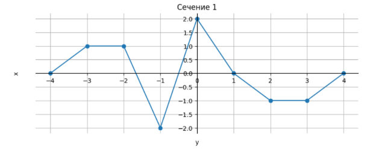

1) Сечение 2 при у = ∆:

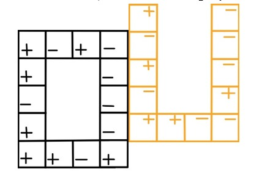

g = (x2 = 4∆; y2 = ∆) = 0

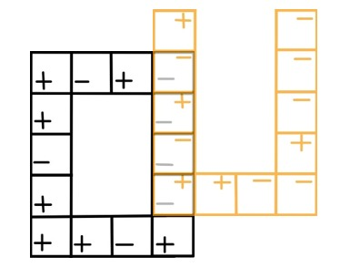

g = (x2 = 3∆; y2 = ∆) = +∆2 - ∆2 + ∆2 - ∆2 = 0

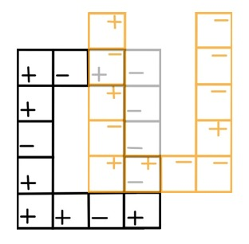

g = (x2 = 2∆; y2 = ∆) = -∆2 - ∆2 = -2∆2

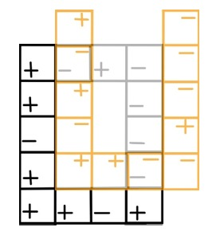

g = (x2 = ∆; y2 = ∆) = +∆2 + ∆2 = 2∆2

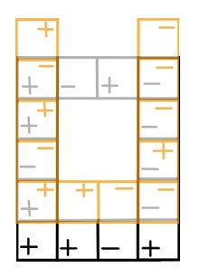

g = (x2 = 0; y2 = ∆) = -∆2 + ∆2 + ∆2 + ∆2 + ∆2 - ∆2 + ∆2 + ∆2 = 4∆2

g = (x2 = -∆; y2 = ∆) = -∆2 + ∆2 = 0

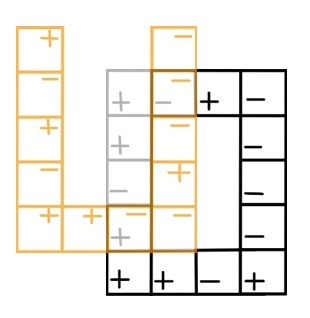

g = (x2 = -2∆; y2 = ∆) = 0

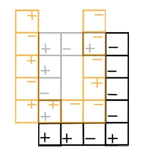

g = (x2 = -3∆; y2 = ∆) = -∆2 - ∆2 - ∆2 - ∆2 = -4∆2

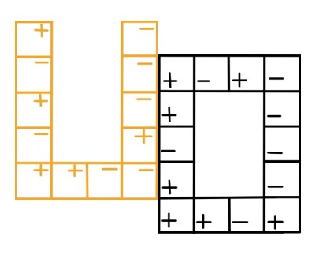

g = (x2 = -4∆; y2 = ∆) = 0

Рис. 3. График интенсивности выходного изображения в сечении у = ∆
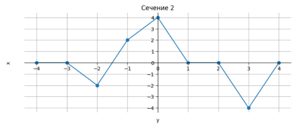

1) Сечение 3 при у = 2∆:

![ref5]

![ref4]![ref8]

*g=(*x2=4∆; y2=2∆)=0

![ref7]*
g=(x2=3∆; y2=2∆)=-∆2+∆2-∆2=-∆2

![ref4]![ref8]

![ref7]*g=(*x2=2∆; y2=2∆)=0

![ref9]

![ref6]

![ref4]

*g=(*x2=∆; y2=2∆)=-∆2+∆2=0

![ref7]

![ref4]![ref8]*g=(*x2=0; y2=2∆)=+∆2-∆2-∆2+∆2-∆2+∆2=0

![ref7]

*g=(*x2=-∆; y2=2∆)=-2∆2

![ref4]![ref8]

![ref7]

![ref9]

*g=(*x2=-2∆; y2=2∆)=2∆2

![ref6]

![ref4]

*g=(*x2=-3∆; y2=2∆)=+∆2+∆2-∆2=∆2

![ref6]

![ref4]![ref8]

*g=(*x2=-4∆; y2=2∆)=0

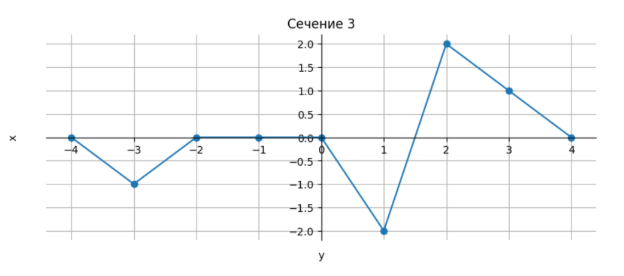Рис. 4. График интенсивности выходного изображения в сечении *у* = 2∆

1) Сечение 4 при *у* = 3∆:

![ref7]

![ref4]![ref8]*g=(*x2=4∆; y2=3∆)=0

![ref7]

![ref4]

*g=(*x2=3∆; y2=3∆)= -∆2+ ∆2=0

![ref7]

![ref4]![ref8]

*g=(*x2=2∆; y2=3∆)= -2∆2

![ref7]

![ref4]![ref8]*g=(*x2=∆; y2=3∆)=2∆2

![ref6]

![ref4]![ref8]

*g=(*x2=0; y2=3∆)=-∆2+∆2+∆2-∆2=0

![ref7]

![ref4]

*g=(*x2=-∆; y2=3∆)=2∆2

![ref7]

![ref4]![ref8]

*g=(*x2=-2∆; y2=3∆)=-2∆2

![ref7]

![ref9]

*g=(*x2=-3∆; y2=3∆)=0

![ref7]

![ref4]![ref8]

*g=(*x2=-4∆; y2=3∆)=0

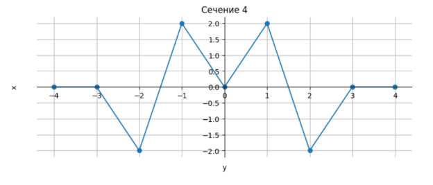

Рис. 5. График интенсивности выходного изображения в сечении *у* = 3∆

1) Сечение 5 при *у* = 4∆:

![ref7]

![ref4]![ref8]

*g=(*x2=4∆; y2=4∆)=0*         

![ref7]

![ref4]![ref8]

*g=(*x2=3∆; y2=4∆)=-∆2

![ref6]

![ref9]

*g=(*x2=2∆; y2=4∆)=0

![ref7]

![ref9]

*g=(*x2=∆; y2=4∆)=-∆2+∆2+∆2=∆2

![ref6]

![ref4]![ref8]

*g=(*x2=0; y2=4∆)=+∆2-∆2-∆2+∆2=0

![ref7]

![ref4]![ref8]

*g=(*x2=-∆; y2=4∆)=-∆2+∆2+∆2=∆2

![ref7]

![ref9]![ref8]

*g=(*x2=-2∆; y2=4∆)=+∆2-∆2=0

![ref7]

![ref9]![ref8]

*g=(*x2=-3∆; y2=4∆)=-∆2

![ref7]

![ref4]![ref8]

*g=(*x2=-4∆; y2=4∆)=0

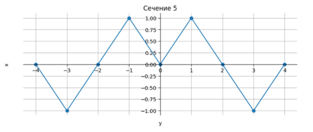

Рис. 6. График интенсивности выходного изображения в сечении *у* = 4∆

**III. Общий график интенсивности выходного изображения.** 

Была построена двумерная интерполяция поля интенсивности на основе заданных сечений.

Этот подход позволяет восстановить непрерывное распределение интенсивности в пространстве между известными точками.

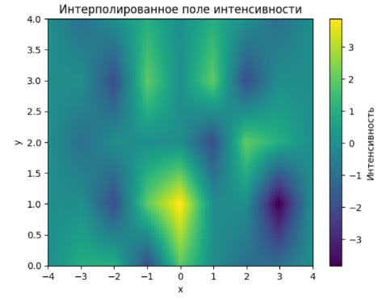

Рис. 8. Двумерное выходное изображение

Результат интерполяции отображается в виде тепловой карты, где цвет соответствует величине интенсивности.

[ref1]: Aspose.Words.2671632b-f25e-4cac-a4be-ccd0d226917a.003.jpeg
[ref2]: Aspose.Words.2671632b-f25e-4cac-a4be-ccd0d226917a.004.png
[ref3]: Aspose.Words.2671632b-f25e-4cac-a4be-ccd0d226917a.006.jpeg
[ref4]: Aspose.Words.2671632b-f25e-4cac-a4be-ccd0d226917a.007.jpeg
[ref5]: Aspose.Words.2671632b-f25e-4cac-a4be-ccd0d226917a.010.jpeg
[ref6]: Aspose.Words.2671632b-f25e-4cac-a4be-ccd0d226917a.011.jpeg
[ref7]: Aspose.Words.2671632b-f25e-4cac-a4be-ccd0d226917a.012.jpeg
[ref8]: Aspose.Words.2671632b-f25e-4cac-a4be-ccd0d226917a.013.png
[ref9]: Aspose.Words.2671632b-f25e-4cac-a4be-ccd0d226917a.015.jpeg
[ref10]: Aspose.Words.2671632b-f25e-4cac-a4be-ccd0d226917a.016.jpeg

