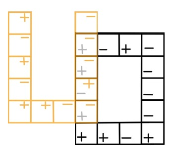
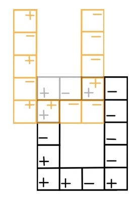

**Цель работы:** вычислить свёртку 2D биполярных изображений «О» и «П» при величине сдвига по оси y = 0, ∆, 2∆, 3∆, 4∆:

Рис. 1. Двумерные биполярные изображения «O» и «П»

**II. Расчёт.** 

1) Отображение «П» по горизонтали:

2) Отображение горизонтального «П» по вертикали:

Таким образом, получаем следующую свертку:

1) Сечение 1 при у = 0:

g = (x2 = 4∆; y2 = 0) = 0

g = (x2 = 3∆; y2 = 0)= -∆2 + ∆2 - ∆2 + ∆2 + ∆2 = ∆2

g = (x2 = 2∆; y2 = 0) = ∆2 - ∆2 + ∆2 = ∆2

g = (x2 = ∆; y2 = 0) = -∆2 + ∆2 - ∆2 - ∆2 = -2∆2

g = (x2 = 0; y2 = 0) = +∆2 - ∆2 - ∆2 - ∆2 + ∆2 + ∆2 + ∆2 - ∆2 - ∆2 + ∆2 + ∆2 + ∆2 = 2∆2

g = (x2 = -∆; y2 = 0) = -∆2 + ∆2 - ∆2 + ∆2 = 0

g = (x2 = -2∆; y2 = 0) = +∆2 - ∆2 - ∆2 = -∆2

g = (x2 = -3∆; y2 = 0) = -∆2 - ∆2 + ∆2 + ∆2 - ∆2 = -∆2

g = (x2 = -4∆; y2 = 0) = 0

Рис. 2. График интенсивности выходного изображения в сечении у = 0

1) Сечение 2 при у = ∆:

g = (x2 = 4∆; y2 = ∆) = 0

g = (x2 = 3∆; y2 = ∆) = +∆2 - ∆2 + ∆2 - ∆2 = 0

g = (x2 = 2∆; y2 = ∆) = -∆2 - ∆2 = -2∆2

g = (x2 = ∆; y2 = ∆) = +∆2 + ∆2 = 2∆2

g = (x2 = 0; y2 = ∆) = -∆2 + ∆2 + ∆2 + ∆2 + ∆2 - ∆2 + ∆2 + ∆2 = 4∆2

g = (x2 = -∆; y2 = ∆) = -∆2 + ∆2 = 0

g = (x2 = -2∆; y2 = ∆) = 0

g = (x2 = -3∆; y2 = ∆) = -∆2 - ∆2 - ∆2 - ∆2 = -4∆2

g = (x2 = -4∆; y2 = ∆) = 0

Рис. 3. График интенсивности выходного изображения в сечении у = ∆

1) Сечение 3 при у = 2∆:

g = (x2 = 4∆; y2 = 2∆) = 0

g = (x2 = 3∆; y2 = 2∆) = -∆2 + ∆2 - ∆2 = -∆2

g=(x2 = 2∆; y2 = 2∆) = 0

g=(x2 = ∆; y2 = 2∆) = -∆2 + ∆2 = 0

g = (x2 = 0; y2 = 2∆) = +∆2 - ∆2 - ∆2 + ∆2 - ∆2 + ∆2 = 0

g = (x2 = -∆; y2 = 2∆) = -2∆2

g = (x2 = -2∆; y2 = 2∆) = 2∆2

g = (x2 = -3∆; y2 = 2∆) = +∆2 + ∆2 - ∆2 = ∆2

g = (x2 = -4∆; y2 = 2∆) = 0

Рис. 4. График интенсивности выходного изображения в сечении у = 2∆

1) Сечение 4 при у = 3∆:

g = (x2 = 4∆; y2 = 3∆) = 0

g = (x2 = 3∆; y2 = 3∆) = -∆2 + ∆2 = 0

g = (x2 = 2∆; y2 = 3∆) = -2∆2

g = (x2 = ∆; y2 = 3∆) = 2∆2

g = (x2 = 0; y2 = 3∆) = -∆2 + ∆2 + ∆2 - ∆2 = 0

g = (x2 = -∆; y2 = 3∆) = 2∆2

g = (x2 = -2∆; y2 = 3∆) = -2∆2

g = (x2 = -3∆; y2 = 3∆) = 0

g = (x2 = -4∆; y2 = 3∆) = 0

Рис. 5. График интенсивности выходного изображения в сечении у = 3∆

1) Сечение 5 при y = 4∆:

g = (x2 = 4∆; y2 = 4∆) = 0         

g = (x2 = 3∆; y2 = 4∆) = -∆2

g = (x2 = 2∆; y2 = 4∆) = 0

g = (x2 = ∆; y2 = 4∆) = -∆2 + ∆2 + ∆2 = ∆2

g = (x2 = 0; y2 = 4∆) = +∆2 - ∆2 - ∆2 + ∆2 = 0

g = (x2 = -∆; y2 = 4∆) = -∆2 + ∆2 + ∆2 = ∆2

g = (x2 = -2∆; y2 = 4∆) = +∆2 - ∆2 = 0

g = (x2 = -3∆; y2 = 4∆) = -∆2

g = (x2 = -4∆; y2 = 4∆) = 0

Рис. 6. График интенсивности выходного изображения в сечении у = 4∆

**III. Общий график интенсивности выходного изображения.** 

Была построена двумерная интерполяция поля интенсивности на основе заданных сечений.

Этот подход позволяет восстановить непрерывное распределение интенсивности в пространстве между известными точками.

Рис. 8. Двумерное выходное изображение

Результат интерполяции отображается в виде тепловой карты, где цвет соответствует величине интенсивности.

