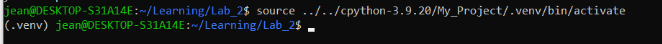
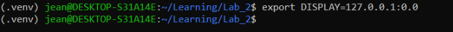
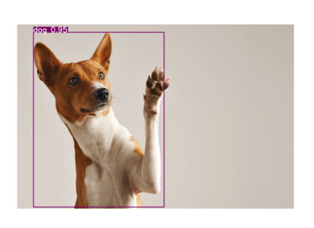
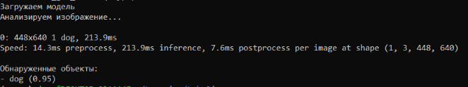
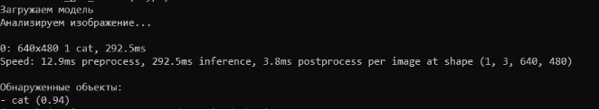

**I. Цель работы.** Классификация в реальном времени изображения с веб-камеры, с помощью библиотеки машинного обучения для языка Python – PyTorch. 

**II. Теоретическое рассмотрение.** 

Особенности использования нейронных сетей в компьютерном зрении:

• **Автоматическое извлечение признаков:**
• Традиционные методы требовали ручной разработки признаков (например, углы, края, текстуры). Нейронные сети, особенно сверточные (CNN), сами учатся находить иерархию признаков из изображений. Первые слои обнаруживают простые признаки, последующие - более сложные.
• Значительно упрощает разработку и повышает устойчивость к вариациям в освещении, масштабе и перспективе.
• **Масштабируемость и адаптивность:**
• Нейронные сети могут решать разнообразные задачи: классификация (определение, что на изображении), обнаружение объектов (нахождение объектов и их местоположения), сегментация (разделение изображения на области).
• Существуют разные архитектуры (CNN, RNN, Transformer и др.), оптимизированные для разных задач, и различные методы обучения.
• **Высокая точность:**
• В большинстве задач нейронные сети показывают более высокую точность, чем традиционные алгоритмы. Точность постоянно улучшается благодаря исследованиям и использованию больших данных.
• Позволяет решать сложные задачи, где требуется высокая надежность.
• **Требовательность к данным:**
• Для эффективного обучения нейронным сетям необходимы большие объемы *размеченных* данных (изображения с указанием, что на них изображено).
• Сбор и разметка данных может быть дорогим и трудоемким. Недостаток данных может привести к переобучению.
• Существуют методы увеличения данных (аугментация), использования предварительно обученных моделей (transfer learning) и обучения без явной разметки (self-supervised learning).
• **Вычислительные затраты:**
• Обучение и применение сложных нейронных сетей требует мощного оборудования, такого как графические процессоры (GPU).
• Это может быть ограничением для использования во встроенных системах или в реальном времени.
• Ведутся разработки по оптимизации архитектур и алгоритмов для снижения вычислительной сложности (квантизация, дистилляция знаний).
• **Сложность интерпретации ("Черный ящик"):**
• Трудно понять, почему нейронная сеть приняла то или иное решение. Это затрудняет отладку и проверку.
• В некоторых областях (медицина, финансы) важна возможность объяснить решения.
• Активно развивается область XAI (Explainable AI), направленная на создание методов интерпретации работы нейронных сетей.

**III. Код программы.** 

Для решения поставленной задачи за основу была взята нейросеть YOLOv8: 

Данная программа написана на Python версии 3.12 для wsl(Windows subsystem for Linux).

import cv2

from ultralytics import YOLO

import matplotlib.pyplot as plt

import tkinter as tk

from tkinter import filedialog

import time

def load\_model():

`    `model = YOLO('yolov8n.pt')

`    `return model

def predict\_image(model, image\_path, conf=0.5):

`    `img = cv2.imread(image\_path)

`    `results = model.predict(img, conf=conf)

`    `annotated\_img = results[0].plot()

`    `annotated\_img\_rgb = cv2.cvtColor(annotated\_img, cv2.COLOR\_BGR2RGB)

`    `plt.figure(figsize=(10, 10))

`    `plt.imshow(annotated\_img\_rgb)

`    `plt.axis('off')

`    `plt.show()

`    `print("\nОбнаруженные объекты:")

`    `for result in results:

`        `for box in result.boxes:

`            `class\_id = int(box.cls)

`            `label = model.names[class\_id]

`            `confidence = float(box.conf)

`            `print(f"- {label} ({confidence:.2f})")

def select\_image():

`    `root = tk.Tk()

`    `root.withdraw()

`    `filepath = filedialog.askopenfilename(

`        `title="Select Image File",

`        `filetypes=[("Image Files", "\*.png;\*.jpg;\*.jpeg;\*.gif;\*.bmp;\*.tiff;\*.webp")]

`    `)

`    `if filepath:

`        `root.destroy()

`        `return filepath

`    `else:

`        `root.destroy()

`        `return None

if \_\_name\_\_ == "\_\_main\_\_":

`    `model = load\_model()

`    `image\_path = select\_image()

`    `print("Загружаем модель")

`    `time.sleep(2)

`    `print("Aнализируем изображение...")

`    `predict\_image(model, image\_path)

Краткое описание работы скрипта: 

1\.  Скрипт запускается и загружает модель YOLOv8. 

2\.  Открывается диалоговое окно для выбора файла изображения. 

3\.  После выбора изображения скрипт выводит сообщения "Загружаем модель" и "Анализируем изображение...". 

4\.  Скрипт использует YOLOv8 для обнаружения объектов на выбранном изображении. 

5\.  Результаты обнаружения отображаются в окне Matplotlib с нарисованными ограничивающими рамками и информацией об обнаруженных объектах (класс, уверенность) выводится в консоль.

**IV. Использование программы.**

Для использование этой программы необходимо подключить виртуальную среду:

source .venv/bin/activate 

Также необходимо подключить внешний дисплей:

export DISPLAY=127.0.0.1:0.0

 

Запуск программы:

Код программы сохранен в analyzer.py

Python3.12 analyzer.py

Открывается проводник, в котором хранятся фотографии скачанные ранее с сайта Freepik.

Выбираем желаемую фотографию.

Результат:

Посмотрим на результат других фотографий для проверки корректности работы программы:

Как мы можем видеть, программы работает корректно.

**V. Вывод.**

Данный код демонстрирует простоту и эффективность использования нейронных сетей для решения задач компьютерного зрения, но также подчеркивает некоторые ограничения, такие как сложность интерпретации и необходимость в вычислительных ресурсах.

